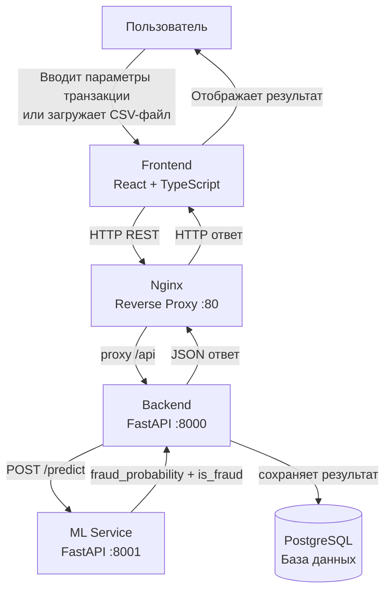
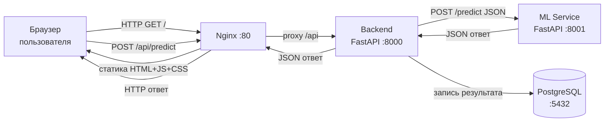

# Лабораторная работа №1: Постановка задачи и высокоуровневое проектирование

**ФИО:** Шамсутдинов Рустам Фаргатевич
**Группа:** БВТ2201
**Тема №14:** Детектор фрода по банковским транзакциям

---

## Шаг 1. Выбор темы

**Тема проекта:** "Детектор фрода по банковским транзакциям"

**Обоснование выбора:**
- Высокая актуальность: по данным Nilson Report, мировые потери от карточного мошенничества превышают $30 млрд в год
- Задача хорошо формализуется как задача бинарной классификации
- Наличие открытых датасетов (Kaggle) для обучения и валидации моделей
- Возможность применения широкого спектра ML-подходов: от классических алгоритмов до ансамблей

---

## Шаг 2. Формулировка бизнес-задачи и ML-интерпретация

### 2.1 Какую проблему решает сервис?

Банки и платёжные системы ежедневно обрабатывают миллионы транзакций, среди которых присутствуют мошеннические операции. Ручная проверка каждой транзакции невозможна из-за объёма данных. Сервис автоматически выявляет подозрительные транзакции в режиме реального времени, позволяя блокировать мошеннические операции до их завершения или сразу после.

### 2.2 Какую выгоду несёт сервис и кто её получит?

| Получатель | Выгода |
|---|---|
| Банк / финансовая организация | Снижение финансовых потерь от фрода, снижение операционных издержек на ручную проверку |
| Клиент банка | Защита средств, быстрое реагирование на подозрительные операции |
| Регуляторные органы | Соответствие требованиям AML/KYC, снижение системных рисков |

### 2.3 Зачем тут ML? Какая его функция?

Мошеннические транзакции имеют сложные, нелинейные паттерны, которые невозможно описать простыми правилами (rule-based системы). ML позволяет:
- Автоматически обнаруживать скрытые паттерны в исторических данных
- Адаптироваться к новым схемам мошенничества при переобучении модели
- Масштабироваться на миллионы транзакций в реальном времени

**Тип задачи ML:** Бинарная классификация с дисбалансом классов (~3.5% мошеннических транзакций).

### 2.4 Входные и выходные данные

**Входные данные (основные признаки из IEEE-CIS):**

| Признак | Тип | Описание |
|---|---|---|
| `TransactionAmt` | float | Сумма транзакции в USD |
| `ProductCD` | categorical | Тип продукта: W / H / C / S / R |
| `card1` | int | Идентификатор платёжной карты |
| `card4` | categorical | Тип карты: visa / mastercard / discover / amex |
| `card6` | categorical | Тип счёта: credit / debit |
| `addr1` | int | Биллинговый регион |
| `P_emaildomain` | categorical | Домен email плательщика |
| `DeviceType` | categorical | Тип устройства: mobile / desktop |
| `TransactionDT` | int | Временная метка транзакции |

**Выходные данные:**
- `fraud_probability` — вероятность мошенничества (float, 0.0–1.0)
- `is_fraud` — бинарное решение (0 — легитимная, 1 — мошенническая)

---

## Шаг 3. Определение метрик качества

### 3.1 Бизнес-метрики

| Метрика | Описание | Целевое значение |
|---|---|---|
| Доля выявленного фрода | % мошеннических транзакций, заблокированных системой | > 90% |
| Коэффициент ложных блокировок | % легитимных транзакций, ошибочно заблокированных | < 0.1% |
| Среднее время детектирования | Время от поступления транзакции до вынесения решения | < 200 мс |

**Влияние качества модели на бизнес:**
- Высокий **Recall** → больше выявленных случаев фрода → прямое снижение финансовых потерь
- Высокий **Precision** → меньше ложных блокировок → лучший клиентский опыт, меньше обращений в поддержку
- Низкая **Latency** → возможность блокировки транзакции в реальном времени

### 3.2 ML-метрики

| Метрика | Обоснование выбора |
|---|---|
| **Recall (Sensitivity)** | Приоритетная метрика: пропущенный фрод дороже ложной блокировки |
| **Precision** | Контролирует количество ложных срабатываний |
| **F1-Score** | Гармоническое среднее Precision и Recall — баланс при дисбалансе классов |
| **PR-AUC** | Основная интегральная метрика при дисбалансе классов: фокусируется только на положительном классе, не искажается большим числом TN |

**Связь ML-метрик с бизнес-метриками:**
- Recall ↔ Доля выявленного фрода
- Precision ↔ Коэффициент ложных блокировок
- F1-Score / PR-AUC ↔ Общая эффективность системы детектирования

**Почему не используется Accuracy:** При дисбалансе классов (~3.5% фрода) модель, предсказывающая всегда "легитимная", даёт Accuracy ~96.5%, что бессмысленно с точки зрения задачи.

---

## Шаг 4. Источник данных и EDA

### 4.1 Источник данных

**Датасет:** [Kaggle — IEEE-CIS Fraud Detection](https://www.kaggle.com/c/ieee-fraud-detection)

| Характеристика | Значение |
|---|---|
| Источник | IEEE Computational Intelligence Society + Vesta Corporation, Kaggle |
| Объём | 590 540 транзакций (train) |
| Таблицы | `transaction` (394 признака) + `identity` (41 признак), объединяются по `TransactionID` |
| Дисбаланс классов | ~3.5% мошеннических транзакций |
| Тип признаков | Числовые, категориальные, временные метки |
| Целевая переменная | `isFraud` (0 / 1) |

### 4.2 Результаты EDA

**Дисбаланс классов:**
- Класс 0 (легитимные): ~96.5% транзакций
- Класс 1 (мошеннические): ~3.5% транзакций
- Требует применения class_weight или SMOTE при обучении

**Анализ признаков:**
- `TransactionAmt`: медиана ~59$, распределение правостороннее; мошеннические транзакции имеют более широкий разброс сумм
- `ProductCD`: категория W доминирует; фрод чаще встречается в категориях H и C
- `card4` / `card6`: visa/mastercard преобладают; debit-карты чаще фигурируют в мошеннических транзакциях
- `P_emaildomain`: gmail.com, yahoo.com, hotmail.com — топ-3; анонимные домены коррелируют с фродом
- `DeviceType`: mobile-транзакции имеют более высокий процент фрода, чем desktop

**Пропущенные значения:** значительное количество пропусков в таблице `identity` (до 50% в некоторых признаках); требуется импутация (медиана для числовых, категория "unknown" для категориальных)

**Выбросы:** присутствуют в `TransactionAmt`; требуется log-трансформация или RobustScaler

**Вывод по EDA:** Датасет содержит интерпретируемые признаки, пригодные для ручного ввода в веб-форму. Основные задачи предобработки: объединение таблиц по `TransactionID`, импутация пропусков, кодирование категориальных признаков, нормализация числовых признаков.

---

## Шаг 5. Проектирование высокоуровневой архитектуры системы

### 5.1 Контекстная диаграмма

### 5.2 Описание основных потоков данных

**а) Взаимодействие пользователя с системой:**
1. Пользователь открывает веб-интерфейс
2. **Сценарий 1 — одиночная транзакция:** вводит параметры вручную → Frontend отправляет JSON в Backend → Backend проксирует запрос в ML Service → ML Service возвращает `fraud_probability` + `is_fraud` → Backend сохраняет результат в БД → Frontend отображает результат
3. **Сценарий 2 — CSV файл:** загружает CSV-файл → Backend парсит CSV построчно и для каждой строки вызывает ML Service → результаты сохраняются в БД → Frontend отображает таблицу результатов

**б) Откуда поступают данные для обучения / инференса:**
- **Обучение:** датасет IEEE-CIS загружается локально, модель обучается offline-скриптом и сохраняется как `.pkl` файл, который монтируется в контейнер ML Service
- **Инференс:** данные поступают от пользователя через Frontend → Backend → ML Service; модель загружается один раз при старте контейнера

**в) Куда сохраняются результаты:**
- Каждый запрос на предсказание сохраняется в PostgreSQL: входные данные + `fraud_probability` + `is_fraud` + `timestamp`
- История предсказаний доступна через Backend API

---

## Шаг 6. Выделение модулей и протоколов взаимодействия

### 6.1 Основные модули и их ответственность

| Модуль | Технологии | Ответственность |
|---|---|---|
| **Frontend** | React, TypeScript | Пользовательский интерфейс: форма ввода транзакции, загрузка CSV, отображение результатов |
| **Nginx** | Nginx | Единая точка входа (:80), раздача статики Frontend, проксирование `/api/...` → Backend |
| **Backend API** | Python, FastAPI | Валидация входных данных, парсинг CSV, проксирование запросов в ML Service, запись результатов в БД |
| **ML Service** | Python, FastAPI, scikit-learn | Загрузка модели при старте (один раз), инференс одной транзакции, возврат `fraud_probability` + `is_fraud` |
| **Database** | PostgreSQL | Хранение истории транзакций и результатов предсказаний |

### 6.2 Диаграмма взаимодействия модулей

### 6.3 Протоколы взаимодействия

| Взаимодействие | Протокол | Формат данных |
|---|---|---|
| Браузер → Nginx (загрузка страницы) | HTTP GET | HTML / CSS / JS |
| Браузер → Nginx → Backend (API) | HTTP REST | JSON (одиночная транзакция) / multipart/form-data (CSV) |
| Backend → ML Service | HTTP REST | JSON (параметры одной транзакции) |
| ML Service → Backend | HTTP REST | JSON (`fraud_probability`, `is_fraud`) |
| Backend → PostgreSQL | PostgreSQL Wire Protocol (TCP) | бинарный протокол через psycopg2 |
| Между контейнерами | Docker internal network | — |

---

## Шаг 7. Предварительный выбор технологий и их обоснование

### 7.1 Frontend: React + TypeScript

**Выбрано:** React + TypeScript

**Почему React:** компонентная архитектура, богатая экосистема, широкое распространение.

**Почему TypeScript:** статическая типизация снижает количество ошибок, улучшает читаемость кода.

**Почему не Vue.js:** меньшее распространение в enterprise-проектах.

**Почему не Angular:** избыточная сложность для данного проекта.

### 7.2 Backend: FastAPI (Python)

**Выбрано:** FastAPI

**Почему FastAPI:** высокая производительность (Starlette + Pydantic), автоматическая OpenAPI-документация, нативный async/await, встроенная валидация данных.

**Почему не Django REST Framework:** избыточен для микросервисной архитектуры, медленнее FastAPI.

**Почему не Flask:** нет встроенной валидации, нет автодокументации, ниже производительность.

### 7.3 ML Service: FastAPI + scikit-learn

**Выбрано:** FastAPI + scikit-learn

**Почему scikit-learn:** богатый набор алгоритмов классификации (RandomForest, GradientBoosting), стандартизированный API (fit/predict), сериализация модели через joblib.

**Почему не TensorFlow/PyTorch:** избыточны для классических ML задач на табличных данных; увеличивают размер Docker-образа и время инференса.

### 7.4 База данных: PostgreSQL

**Выбрано:** PostgreSQL

**Почему PostgreSQL:** надёжность и ACID-транзакции для финансовых данных, поддержка сложных запросов, хорошая интеграция с Python (psycopg2, SQLAlchemy).

**Почему не MongoDB:** слабее гарантии консистентности для структурированных транзакционных данных.

**Почему не SQLite:** ограниченная масштабируемость записи.

### 7.5 Reverse Proxy: Nginx

**Выбрано:** Nginx

**Почему Nginx:** высокая производительность при раздаче статики и проксировании, единая точка входа для статики и API, простая конфигурация `try_files` + `proxy_pass`.

**Почему не Apache:** ниже производительность при высокой нагрузке, сложнее конфигурация для SPA + reverse proxy.

### 7.6 Контейнеризация: Docker + docker-compose

**Выбрано:** Docker + docker-compose

**Почему Docker:** изоляция сервисов, воспроизводимость окружения, простота развёртывания.

**Почему docker-compose:** удобная оркестрация нескольких контейнеров для разработки и тестирования.

**Почему не Kubernetes:** избыточная сложность для учебного проекта.

---

## Ссылки на источники

1. [Kaggle — IEEE-CIS Fraud Detection Dataset](https://www.kaggle.com/c/ieee-fraud-detection) — датасет для обучения модели
2. [IEEE-CIS Fraud Detection — Data Description](https://www.kaggle.com/c/ieee-fraud-detection/discussion/101203) — описание признаков датасета
3. [FastAPI Documentation](https://fastapi.tiangolo.com/) — документация по FastAPI
4. [scikit-learn Documentation](https://scikit-learn.org/stable/) — документация по scikit-learn
5. [React Documentation](https://react.dev/) — документация по React
6. [PostgreSQL Documentation](https://www.postgresql.org/docs/) — документация по PostgreSQL
7. [Docker Documentation](https://docs.docker.com/) — документация по Docker
8. [Nginx Documentation](https://nginx.org/en/docs/) — документация по Nginx

---

*Отчёт подготовлен в соответствии с требованиями лабораторной работы №1*
