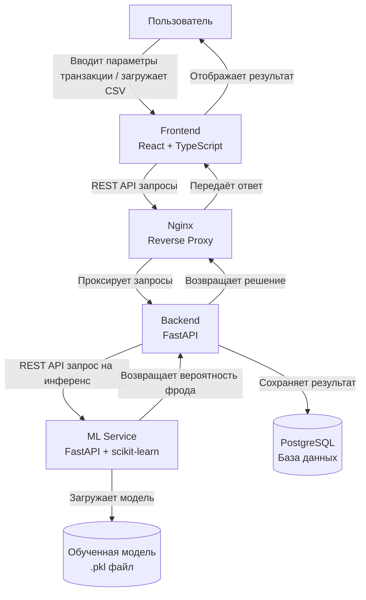
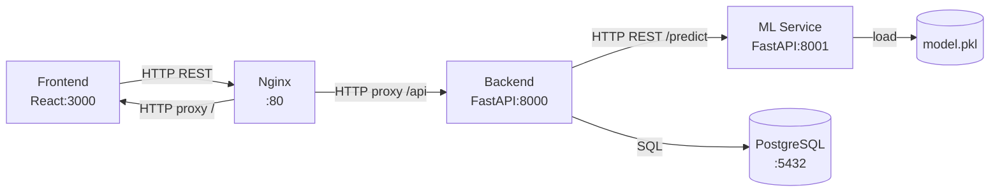

# Лабораторная работа №1: Постановка задачи и высокоуровневое проектирование

**ФИО:** Шамсутдинов Рустам Фаргатевич
**Группа:** БВТ2201
**Тема №14:** Детектор фрода по банковским транзакциям

---

## Шаг 1. Выбор темы

**Тема проекта:** "Детектор фрода по банковским транзакциям"

**Обоснование выбора:**
- Высокая актуальность: по данным Nilson Report, мировые потери от карточного мошенничества превышают $30 млрд в год
- Задача хорошо формализуется как задача бинарной классификации
- Наличие открытых датасетов (Kaggle) для обучения и валидации моделей
- Возможность применения широкого спектра ML-подходов: от классических алгоритмов до ансамблей

---

## Шаг 2. Формулировка бизнес-задачи и ML-интерпретация

### 2.1 Какую проблему решает сервис?

Банки и платёжные системы ежедневно обрабатывают миллионы транзакций, среди которых присутствуют мошеннические операции. Ручная проверка каждой транзакции невозможна из-за объёма данных. Сервис автоматически выявляет подозрительные транзакции в режиме реального времени, позволяя блокировать мошеннические операции до их завершения или сразу после.

### 2.2 Какую выгоду несёт сервис и кто её получит?

| Получатель | Выгода |
|---|---|
| Банк / финансовая организация | Снижение финансовых потерь от фрода, снижение операционных издержек на ручную проверку |
| Клиент банка | Защита средств, быстрое реагирование на подозрительные операции |
| Регуляторные органы | Соответствие требованиям AML/KYC, снижение системных рисков |

### 2.3 Зачем тут ML? Какая его функция?

Мошеннические транзакции имеют сложные, нелинейные паттерны, которые невозможно описать простыми правилами (rule-based системы). ML позволяет:
- Автоматически обнаруживать скрытые паттерны в исторических данных
- Адаптироваться к новым схемам мошенничества (переобучение модели)
- Масштабироваться на миллионы транзакций в реальном времени

**Тип задачи ML:** Бинарная классификация с сильным дисбалансом классов (~0.17% фрода).

### 2.4 Входные и выходные данные

**Входные данные:**
- Числовые признаки транзакции: `V1–V28` (PCA-преобразованные анонимизированные атрибуты)
- `Amount` — сумма транзакции
- `Time` — время с момента первой транзакции в датасете

**Выходные данные:**
- `fraud_probability` — вероятность мошенничества (float, 0.0–1.0)
- `is_fraud` — бинарное решение (0 — легитимная, 1 — мошенническая)

---

## Шаг 3. Определение метрик качества

### 3.1 Бизнес-метрики

| Метрика | Описание | Целевое значение |
|---|---|---|
| Доля выявленного фрода | % мошеннических транзакций, заблокированных системой | > 90% |
| Коэффициент ложных блокировок | % легитимных транзакций, ошибочно заблокированных | < 0.1% |
| Среднее время детектирования | Время от поступления транзакции до вынесения решения | < 200 мс |

**Влияние качества модели на бизнес:**
- Высокий **Recall** → больше выявленных случаев фрода → прямое снижение финансовых потерь
- Высокий **Precision** → меньше ложных блокировок → лучший клиентский опыт, меньше обращений в поддержку
- Низкая **Latency** → возможность блокировки транзакции в реальном времени

### 3.2 ML-метрики

| Метрика | Обоснование выбора |
|---|---|
| **Recall (Sensitivity)** | Приоритетная метрика: пропущенный фрод дороже ложной блокировки |
| **Precision** | Контролирует количество ложных срабатываний |
| **F1-Score** | Гармоническое среднее Precision и Recall — баланс при дисбалансе классов |
| **PR-AUC** | Основная интегральная метрика при дисбалансе классов: фокусируется только на положительном классе (фрод), не искажается большим числом TN |

**Связь ML-метрик с бизнес-метриками:**
- Recall ↔ Доля выявленного фрода
- Precision ↔ Коэффициент ложных блокировок
- F1-Score / PR-AUC ↔ Общая эффективность системы детектирования
- Inference latency ↔ Среднее время детектирования

**Почему не используется Accuracy:** При дисбалансе классов (0.17% фрода) модель, предсказывающая всегда "легитимная", даёт Accuracy ~99.83%, что бессмысленно с точки зрения задачи.

---

## Шаг 4. Источник данных и EDA

### 4.1 Источник данных

**Датасет:** [Kaggle — Credit Card Fraud Detection](https://www.kaggle.com/mlg-ulb/creditcardfraud)

| Характеристика | Значение |
|---|---|
| Источник | ULB Machine Learning Group, Kaggle |
| Объём | 284 807 транзакций |
| Признаки | 30 (V1–V28, Time, Amount) + целевая переменная Class |
| Дисбаланс классов | 492 фрода (0.172%) / 284 315 легитимных |
| Тип признаков | Числовые (V1–V28 — результат PCA-преобразования для анонимизации) |

### 4.2 Результаты EDA

**Дисбаланс классов:**
- Класс 0 (легитимные): 284 315 транзакций (99.83%)
- Класс 1 (мошеннические): 492 транзакции (0.17%)
- Вывод: необходимо применять SMOTE, undersampling или class_weight при обучении

**Анализ признаков:**
- Признаки V1–V28 — анонимизированы через PCA, интерпретация невозможна
- `Amount`: медиана ~22$, максимум ~25 691$; мошеннические транзакции чаще имеют небольшие суммы
- `Time`: транзакции распределены по двум суточным циклам; фрод встречается в любое время суток

**Пропущенные значения:** отсутствуют (датасет предобработан)

**Корреляции:** признаки V1–V28 слабо коррелируют между собой (результат PCA); `Amount` и `Time` не коррелируют с остальными признаками

**Выбросы:** присутствуют в `Amount` (экстремально крупные транзакции); требуется нормализация/стандартизация

**Вывод по EDA:** Датасет чистый, без пропусков. Главная проблема — сильный дисбаланс классов. Необходима нормализация `Amount` и `Time`. Признаки V1–V28 уже нормализованы.

---

## Шаг 5. Проектирование высокоуровневой архитектуры системы

### 5.1 Контекстная диаграмма

### 5.2 Описание основных потоков данных

**а) Взаимодействие пользователя с системой:**
1. Пользователь открывает веб-интерфейс (Frontend)
2. Вводит параметры транзакции вручную или загружает CSV-файл
3. Frontend отправляет данные в Backend через REST API (через Nginx)
4. Backend возвращает результат (вероятность фрода + решение)
5. Frontend отображает результат пользователю

**б) Откуда поступают данные для обучения / инференса:**
- **Обучение:** датасет Kaggle загружается локально, модель обучается скриптом и сохраняется как `.pkl` файл
- **Инференс:** данные поступают от пользователя через Frontend → Backend → ML Service в реальном времени

**в) Куда сохраняются результаты:**
- Каждый запрос на предсказание сохраняется в PostgreSQL (входные данные + результат + timestamp)
- История предсказаний доступна через Backend API

---

## Шаг 6. Выделение модулей и протоколов взаимодействия

### 6.1 Основные модули и их ответственность

| Модуль | Технологии | Ответственность |
|---|---|---|
| **Frontend** | React, TypeScript | Пользовательский интерфейс: форма ввода транзакции, загрузка CSV, отображение результатов |
| **Nginx** | Nginx | Reverse proxy, единая точка входа, маршрутизация запросов к Backend |
| **Backend API** | Python, FastAPI | Валидация входных данных, бизнес-логика, проксирование к ML Service, запись в БД |
| **ML Service** | Python, FastAPI, scikit-learn | Загрузка модели, предобработка признаков, инференс, возврат вероятности фрода |
| **Database** | PostgreSQL | Хранение истории транзакций и результатов предсказаний |
| **Containerization** | Docker, docker-compose | Изоляция и оркестрация всех сервисов |

### 6.2 Диаграмма взаимодействия модулей

### 6.3 Протоколы взаимодействия

| Взаимодействие | Протокол | Формат данных |
|---|---|---|
| Пользователь → Frontend | HTTP/HTTPS | HTML/JS |
| Frontend → Nginx | HTTP REST | JSON |
| Nginx → Backend | HTTP REST | JSON |
| Backend → ML Service | HTTP REST | JSON |
| Backend → PostgreSQL | SQL (TCP) | SQL-запросы |
| docker-compose → все сервисы | Docker network | — |

---

## Шаг 7. Предварительный выбор технологий и их обоснование

### 7.1 Frontend: React + TypeScript

**Выбрано:** React + TypeScript

**Почему React:**
- Компонентная архитектура упрощает разработку UI
- Богатая экосистема (библиотеки для форм, таблиц, графиков)
- Широкое распространение, большое сообщество

**Почему TypeScript:**
- Статическая типизация снижает количество ошибок на этапе разработки
- Улучшает читаемость и поддерживаемость кода

**Почему не Vue.js:** Меньшее распространение в enterprise-проектах, меньше готовых компонентов для работы с данными.

**Почему не Angular:** Избыточная сложность и объём фреймворка для данного проекта.

### 7.2 Backend: FastAPI (Python)

**Выбрано:** FastAPI

**Почему FastAPI:**
- Высокая производительность (основан на Starlette + Pydantic)
- Автоматическая генерация OpenAPI/Swagger документации
- Нативная поддержка async/await
- Встроенная валидация данных через Pydantic

**Почему не Django REST Framework:** Избыточен для микросервисной архитектуры, медленнее FastAPI.

**Почему не Flask:** Отсутствие встроенной валидации, нет автодокументации, ниже производительность.

### 7.3 ML Service: FastAPI + scikit-learn + pandas

**Выбрано:** FastAPI + scikit-learn + pandas

**Почему scikit-learn:**
- Богатый набор алгоритмов классификации (RandomForest, GradientBoosting, LogisticRegression)
- Стандартизированный API (fit/predict)
- Хорошая документация и воспроизводимость результатов
- Поддержка сериализации моделей через joblib/pickle

**Почему не TensorFlow/PyTorch:** Избыточны для классических ML задач на табличных данных; увеличивают размер Docker-образа и время инференса.

**Почему pandas:** Стандарт для работы с табличными данными в Python; удобная предобработка CSV-файлов.

### 7.4 База данных: PostgreSQL

**Выбрано:** PostgreSQL

**Почему PostgreSQL:**
- Надёжность и ACID-транзакции для финансовых данных
- Поддержка сложных SQL-запросов и индексов
- Широкое распространение, хорошая интеграция с Python (psycopg2, SQLAlchemy)

**Почему не MongoDB:** Документо-ориентированная БД менее подходит для структурированных транзакционных данных; слабее гарантии консистентности.

**Почему не SQLite:** Не подходит для production-окружения, нет поддержки конкурентных запросов.

### 7.5 Reverse Proxy: Nginx

**Выбрано:** Nginx

**Почему Nginx:**
- Высокая производительность при обработке статики и проксировании
- Единая точка входа для всех сервисов
- Простая конфигурация для reverse proxy

**Почему не Apache:** Ниже производительность при высокой нагрузке; более сложная конфигурация для reverse proxy.

### 7.6 Контейнеризация: Docker + docker-compose

**Выбрано:** Docker + docker-compose

**Почему Docker:** Изоляция сервисов, воспроизводимость окружения, простота развёртывания.

**Почему docker-compose:** Удобная оркестрация нескольких контейнеров для разработки и тестирования.

**Почему не Kubernetes:** Избыточная сложность для учебного проекта; Kubernetes оправдан при масштабировании на production-кластеры.

---

## Ссылки на источники

1. [Kaggle — Credit Card Fraud Detection Dataset](https://www.kaggle.com/mlg-ulb/creditcardfraud) — датасет для обучения модели
2. [Dal Pozzolo et al., 2015 — Calibrating Probability with Undersampling for Unbalanced Classification](https://ieeexplore.ieee.org/document/7376606) — научная работа авторов датасета
3. [FastAPI Documentation](https://fastapi.tiangolo.com/) — документация по FastAPI
4. [scikit-learn Documentation](https://scikit-learn.org/stable/) — документация по scikit-learn
5. [React Documentation](https://react.dev/) — документация по React
6. [PostgreSQL Documentation](https://www.postgresql.org/docs/) — документация по PostgreSQL
7. [Docker Documentation](https://docs.docker.com/) — документация по Docker
8. [Nginx Documentation](https://nginx.org/en/docs/) — документация по Nginx

---

*Отчёт подготовлен в соответствии с требованиями лабораторной работы №1*
