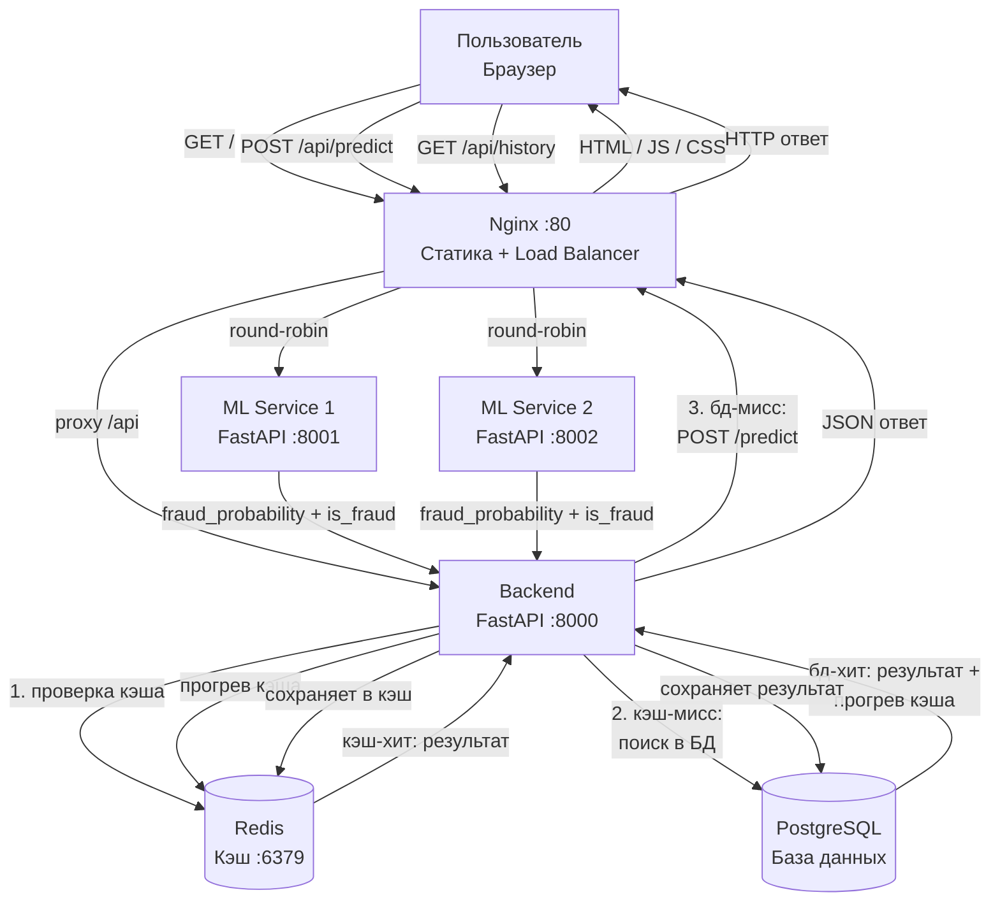

# Лабораторная работа №2: Корректировка архитектуры системы

**ФИО:** Шамсутдинов Рустам Фаргатевич
**Группа:** БВТ2201
**Тема:** Детектор фрода по банковским транзакциям

---

## Шаг 1. Стратегия валидации и воспроизводимость

### Стратегия валидации

Датасет IEEE-CIS содержит временну́ю метку `TransactionDT`. Транзакции упорядочены во времени, поэтому нельзя делать случайное разбиение — иначе модель будет обучаться на «будущих» данных и предсказывать «прошлые», что нереалистично.

Выбрана стратегия **временно́го разбиения**:

| Выборка | Доля | Назначение |
|---|---|---|
| Train | 80% (первые по времени) | Обучение модели |
| Validation | 10% | Подбор гиперпараметров |
| Test | 10% (последние по времени) | Финальная оценка (один раз) |

Тестовая выборка используется строго один раз — только после того, как модель полностью готова. Это гарантирует, что метрики на тесте не завышены.

### Что версионировать для воспроизводимости

| Компонент | Как фиксируется |
|---|---|
| Данные | Датасет хранится локально, версия фиксируется в README (название файла + источник) |
| Код | Git (хэш коммита) |
| Модель | Файл `.pkl` (сохраняется скриптом обучения), имя файла включает версию (например, `model_v1.pkl`) |
| Гиперпараметры | Зафиксированы в коде обучающего скрипта, `random_state=42` везде |
| Окружение | `requirements.txt` + Docker-образ с фиксированными версиями библиотек |

Для воспроизводимости достаточно: взять тот же Git-коммит, тот же датасет и запустить обучающий скрипт — результат будет идентичным.

---

## Шаг 2. Анализ утечек данных

В системе детектора фрода обрабатываются реальные банковские транзакции — данные о картах, суммах, устройствах. Это чувствительные данные, и их утечка злоумышленникам может нанести прямой финансовый ущерб клиентам.

### Источники утечек и способы предотвращения

**1. Утечка через логи**

Сервисы логируют входящие запросы. Если логи пишутся в открытом виде, данные транзакций (номера карт, суммы) могут попасть в лог-файлы.

*Предотвращение:* логировать только метаданные (время, статус ответа, `is_fraud`), но не сами значения признаков. Чувствительные поля маскировать перед записью в лог.

**2. Утечка через незащищённые внутренние сервисы**

Внутренние компоненты системы (БД, кэш) по умолчанию могут быть доступны без аутентификации. Если злоумышленник получит доступ к сети — он получит все данные.

*Предотвращение:* все внутренние сервисы должны быть изолированы и доступны только внутри системы. Использовать аутентификацию и минимальные права доступа. Хранить только необходимый минимум данных.

**3. Утечка через API**

Если API не ограничивает количество запросов, злоумышленник может массово запрашивать предсказания и восстановить логику модели или собрать данные о транзакциях.

*Предотвращение:* ограничить количество запросов с одного источника (rate limiting). Возвращать в ответе только необходимое — `fraud_probability` и `is_fraud`, без отражения входных данных обратно.

**4. Утечка при передаче данных**

Данные транзакций передаются между клиентом и сервером по сети. Без шифрования их можно перехватить.

*Предотвращение:* использовать HTTPS для всех внешних соединений (TLS-сертификат на Nginx). Внутренние соединения между контейнерами защищены изолированной Docker-сетью.

---

## Шаг 3. Масштабирование

### Оценка нагрузки

| Параметр | Значение |
|---|---|
| Средний трафик | 10–20 запросов/сек, ~1–2 KB на запрос |
| Пиковый трафик | 50–100 запросов/сек (пиковые часы, распродажи) |
| Допустимая latency | < 200 мс (транзакция должна быть проверена до авторизации) |

### Как масштабировать

Текущая архитектура справляется с нагрузкой до ~50 RPS: один экземпляр каждого сервиса, Redis снижает нагрузку на ML Service при повторных запросах.

**Кэширование:** Redis хранит результаты предсказаний (TTL = 1 час). При повторном запросе с теми же параметрами ML Service не вызывается — ответ возвращается мгновенно.

Ключ кэша формируется как SHA256-хэш от JSON-сериализации всех полей транзакции (например, `sha256('{"TransactionAmt": 100.0, "ProductCD": "W", ...}')`). Это компактная строка фиксированной длины, которая однозначно идентифицирует набор входных данных.

Теоретически у разных наборов данных может получиться одинаковый хэш (коллизия), но вероятность этого при SHA256 ничтожно мала — порядка 1 к 10⁷⁷. На практике для кэша предсказаний это не является проблемой. Альтернатива — конкатенация значений полей через разделитель (`100.0:W:visa:...`), но это длиннее, зависит от порядка полей и не даёт никаких преимуществ по надёжности.

**При росте нагрузки** узким местом станет ML Service. Решение — **горизонтальное масштабирование**: запустить несколько реплик ML Service, Nginx будет распределять запросы между ними (round-robin). Модель `.pkl` монтируется как read-only volume — все реплики используют одну копию.

Если latency выше допустимого:
1. Найти узкое место (ML инференс, БД, сеть)
2. Добавить реплики ML Service
3. Увеличить TTL кэша Redis
4. Оптимизировать модель
---

## Шаг 4. Корректировка архитектуры

На основе шагов 1–3 в архитектуру вносятся следующие изменения:
- **Шаг 1 (воспроизводимость):** новых компонентов в рантайм-архитектуре не добавляется — версионирование обеспечивается на уровне процесса разработки (Git, файлы `.pkl`, `requirements.txt`)
- **Шаг 3 (масштабирование):** Nginx настраивается как **load balancer** с несколькими репликами ML Service (горизонтальное масштабирование); кэш Redis уже реализован
- Остальные компоненты (Backend, PostgreSQL) без изменений

### Обновлённая контекстная диаграмма (Шаг 5 ЛР1)

### Обновлённый список модулей (Шаг 6 ЛР1)

| Модуль | Технологии | Ответственность |
|---|---|---|
| Frontend | React, TypeScript | Интерфейс пользователя |
| Nginx | Nginx | Статика, проксирование, **балансировка между репликами ML Service** |
| Backend API | Python, FastAPI | Валидация, парсинг CSV, запись в БД и кэш |
| ML Service | Python, FastAPI, scikit-learn | Инференс модели; **запускается в нескольких репликах** |
| Cache | Redis | Кэш результатов (TTL = 1 час) |
| Database | PostgreSQL | История транзакций |

Стек технологий (Шаг 7 ЛР1) остаётся без изменений: React, FastAPI, scikit-learn, Redis, PostgreSQL, Nginx, Docker + docker-compose.

---

## Ссылки на источники

1. [Kaggle — IEEE-CIS Fraud Detection](https://www.kaggle.com/c/ieee-fraud-detection)
2. [scikit-learn Pipeline](https://scikit-learn.org/stable/modules/generated/sklearn.pipeline.Pipeline.html)
3. [Nginx Upstream Module](https://nginx.org/en/docs/http/ngx_http_upstream_module.html)
