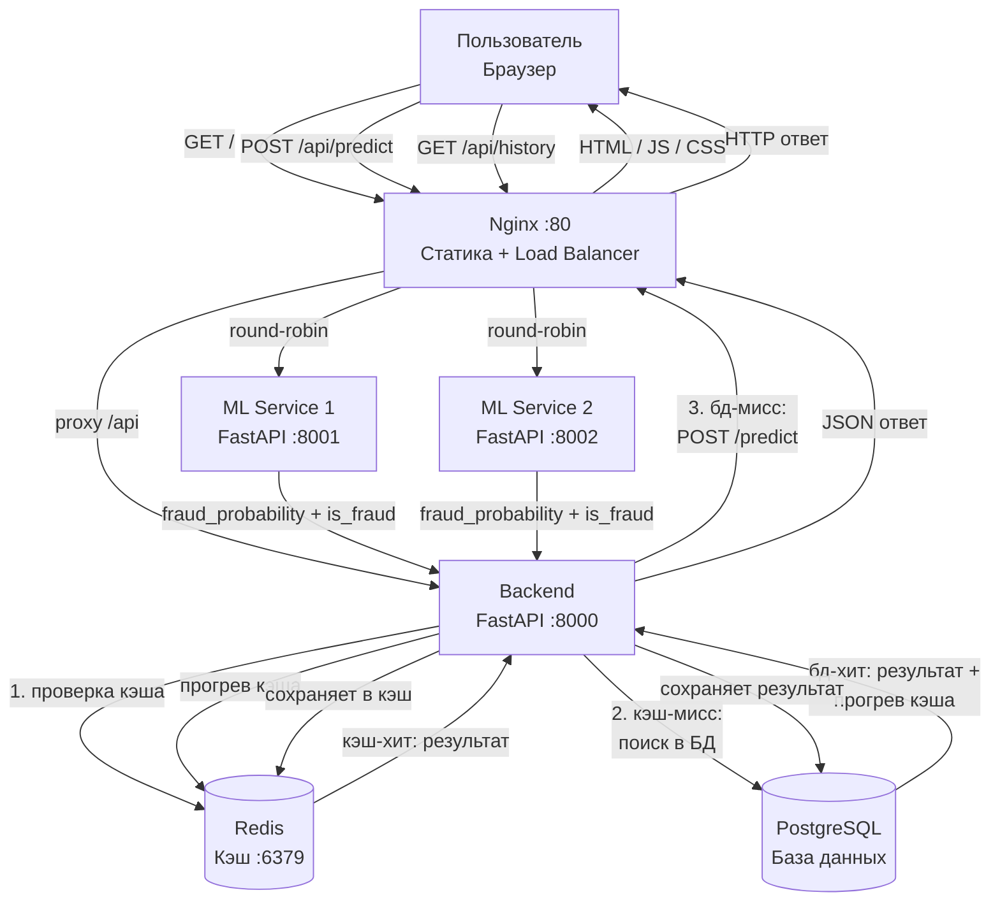

# Лабораторная работа №2: Корректировка архитектуры системы

**ФИО:** Шамсутдинов Рустам Фаргатевич
**Группа:** БВТ2201
**Тема:** Детектор фрода по банковским транзакциям

---

## Шаг 1. Стратегия валидации и воспроизводимость

### Стратегия валидации

Датасет IEEE-CIS содержит временну́ю метку `TransactionDT`. Транзакции упорядочены во времени, поэтому нельзя делать случайное разбиение — иначе модель будет обучаться на «будущих» данных и предсказывать «прошлые», что нереалистично.

Выбрана стратегия **временно́го разбиения**:

| Выборка | Доля | Назначение |
|---|---|---|
| Train | 80% (первые по времени) | Обучение модели |
| Validation | 10% | Подбор гиперпараметров |
| Test | 10% (последние по времени) | Финальная оценка (один раз) |

Тестовая выборка используется строго один раз — только после того, как модель полностью готова. Это гарантирует, что метрики на тесте не завышены.

### Что версионировать для воспроизводимости

| Компонент | Как фиксируется |
|---|---|
| Данные | Датасет хранится локально, версия фиксируется в README (название файла + источник) |
| Код | Git (хэш коммита) |
| Модель | Файл `.pkl` (сохраняется скриптом обучения), имя файла включает версию (например, `model_v1.pkl`) |
| Гиперпараметры | Зафиксированы в коде обучающего скрипта, `random_state=42` везде |
| Окружение | `requirements.txt` + Docker-образ с фиксированными версиями библиотек |

Для воспроизводимости достаточно: взять тот же Git-коммит, тот же датасет и запустить обучающий скрипт — результат будет идентичным.

---

## Шаг 2. Анализ утечек данных

Data leakage (утечка данных при обучении) — ситуация, когда в процессе обучения модель получает доступ к информации, которая недоступна в момент реального предсказания. Это приводит к завышенным метрикам на валидации и деградации качества в продакшне. Ниже описаны потенциальные источники data leakage для задачи детектора фрода на датасете IEEE-CIS.

### Источники data leakage и способы предотвращения

**1. Утечка целевой переменной (target leakage)**

Некоторые признаки могут быть вычислены с использованием целевой переменной `isFraud` или коррелировать с ней причинно-следственно в обратную сторону: то есть признак принимает определённое значение *потому что* транзакция уже помечена как мошенническая, а не наоборот. Например, агрегаты по карте (`card1`–`card6`), вычисленные по всему датасету, включают информацию о будущих фродовых транзакциях.

*Предотвращение:* агрегированные признаки (средняя сумма по карте, частота транзакций) вычислять **только по обучающей выборке**, затем применять к валидационной и тестовой. Все трансформации выполнять внутри `sklearn.Pipeline`, чтобы исключить случайное использование тестовых данных при `fit`.

**2. Утечка через случайное разбиение (temporal leakage)**

Датасет IEEE-CIS содержит временну́ю метку `TransactionDT`. Если применить случайное разбиение (`train_test_split` без учёта времени), модель будет обучаться на транзакциях из «будущего» и предсказывать «прошлое». Это нереалистично: в продакшне модель всегда предсказывает будущие транзакции по паттернам из прошлых.

*Предотвращение:* использовать **временно́е разбиение** — первые 80% транзакций по времени идут в train, следующие 10% в validation, последние 10% в test.

**3. Утечка через препроцессинг (preprocessing leakage)**

Если нормализация, заполнение пропусков или кодирование категорий выполняются по всему датасету до разбиения, статистики (среднее, медиана, частоты категорий) вычисляются с учётом тестовых данных. Модель косвенно «видит» тест при обучении.

*Предотвращение:* все шаги препроцессинга (`SimpleImputer`, `StandardScaler`, `OrdinalEncoder`) обёрнуты в `sklearn.Pipeline`. Метод `fit` вызывается **только на обучающей выборке**, `transform` — на валидационной и тестовой. Разбиение на train/val/test выполняется **до** любого `fit`.

**4. Утечка через кросс-валидацию без учёта времени**

Стандартный `KFold` перемешивает данные случайно, что для временны́х рядов эквивалентно temporal leakage: в одном фолде обучающая часть содержит транзакции из «будущего» относительно валидационной.

*Предотвращение:* для временны́х данных использовать `TimeSeriesSplit` из scikit-learn, который гарантирует, что валидационный фолд всегда хронологически позже обучающего. В данной задаче кросс-валидация не применяется — используется фиксированное временно́е разбиение, что полностью исключает этот риск.

**5. Утечка через признаки, недоступные в момент предсказания (future data leakage)**

Некоторые признаки датасета IEEE-CIS (например, агрегаты по `TransactionID` или поля, вычисленные по результатам расследования мошенничества) могут быть доступны только после завершения транзакции или её проверки. Использование таких признаков при обучении приводит к нереалистично высокому качеству.

*Предотвращение:* при формировании набора признаков проверять, доступен ли каждый признак **в момент совершения транзакции** (до её авторизации). Признаки, которые появляются только после факта мошенничества, исключать из обучения. В датасете IEEE-CIS большинство признаков (`TransactionAmt`, `ProductCD`, `card*`, `addr*`, `dist*`, `C*`, `D*`, `M*`, `V*`) доступны в момент транзакции — явного future leakage нет, однако это необходимо верифицировать при добавлении новых признаков.

---

## Шаг 3. Масштабирование

### Оценка нагрузки

| Параметр | Значение |
|---|---|
| Средний трафик | 10–20 запросов/сек, ~1–2 KB на запрос |
| Пиковый трафик | 50–100 запросов/сек (пиковые часы, распродажи) |
| Допустимая latency | < 200 мс (транзакция должна быть проверена до авторизации) |

### Как масштабировать

Текущая архитектура справляется с нагрузкой до ~50 RPS: один экземпляр каждого сервиса, Redis снижает нагрузку на ML Service при повторных запросах.

**Кэширование:** Redis хранит результаты предсказаний (TTL = 1 час). При повторном запросе с теми же параметрами ML Service не вызывается — ответ возвращается мгновенно.

Ключ кэша формируется как SHA256-хэш от JSON-сериализации всех полей транзакции (например, `sha256('{"TransactionAmt": 100.0, "ProductCD": "W", ...}')`). Это компактная строка фиксированной длины, которая однозначно идентифицирует набор входных данных.

Теоретически у разных наборов данных может получиться одинаковый хэш (коллизия), но вероятность этого при SHA256 ничтожно мала — порядка 1 к 10⁷⁷. На практике для кэша предсказаний это не является проблемой. Альтернатива — конкатенация значений полей через разделитель (`100.0:W:visa:...`), но это длиннее, зависит от порядка полей и не даёт никаких преимуществ по надёжности.

**При росте нагрузки** узким местом станет ML Service. Решение — **горизонтальное масштабирование**: запустить несколько реплик ML Service, Nginx будет распределять запросы между ними (round-robin). Модель `.pkl` монтируется как read-only volume — все реплики используют одну копию.

Если latency выше допустимого:
1. Найти узкое место (ML инференс, БД, сеть)
2. Добавить реплики ML Service
3. Увеличить TTL кэша Redis
4. Оптимизировать модель
---

## Шаг 4. Корректировка архитектуры

На основе шагов 1–3 в архитектуру вносятся следующие изменения:
- **Шаг 1 (воспроизводимость):** новых компонентов в рантайм-архитектуре не добавляется — версионирование обеспечивается на уровне процесса разработки (Git, файлы `.pkl`, `requirements.txt`)
- **Шаг 3 (масштабирование):** Nginx настраивается как **load balancer** с несколькими репликами ML Service (горизонтальное масштабирование); кэш Redis уже реализован
- Остальные компоненты (Backend, PostgreSQL) без изменений

### Обновлённая контекстная диаграмма (Шаг 5 ЛР1)

### Обновлённый список модулей (Шаг 6 ЛР1)

| Модуль | Технологии | Ответственность |
|---|---|---|
| Frontend | React, TypeScript | Интерфейс пользователя |
| Nginx | Nginx | Статика, проксирование, **балансировка между репликами ML Service** |
| Backend API | Python, FastAPI | Валидация, парсинг CSV, запись в БД и кэш |
| ML Service | Python, FastAPI, scikit-learn | Инференс модели; **запускается в нескольких репликах** |
| Cache | Redis | Кэш результатов (TTL = 1 час) |
| Database | PostgreSQL | История транзакций |

Стек технологий (Шаг 7 ЛР1) остаётся без изменений: React, FastAPI, scikit-learn, Redis, PostgreSQL, Nginx, Docker + docker-compose.

---

## Ссылки на источники

1. [Kaggle — IEEE-CIS Fraud Detection](https://www.kaggle.com/c/ieee-fraud-detection)
2. [scikit-learn Pipeline](https://scikit-learn.org/stable/modules/generated/sklearn.pipeline.Pipeline.html)
3. [Nginx Upstream Module](https://nginx.org/en/docs/http/ngx_http_upstream_module.html)
