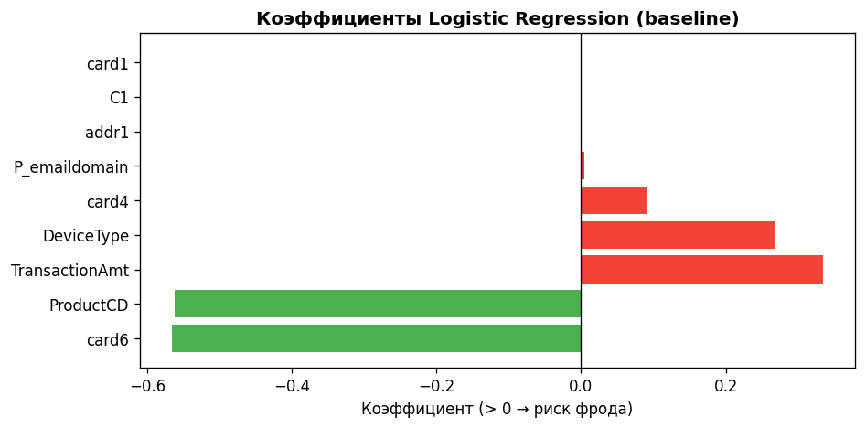
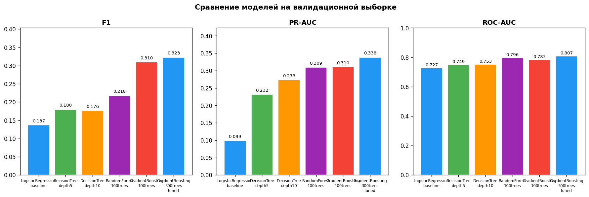
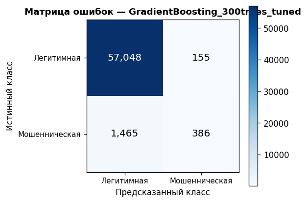
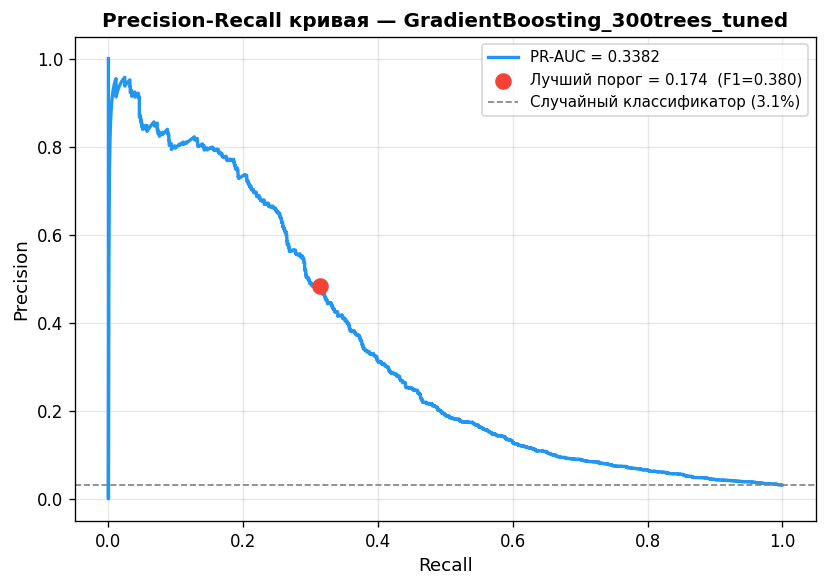
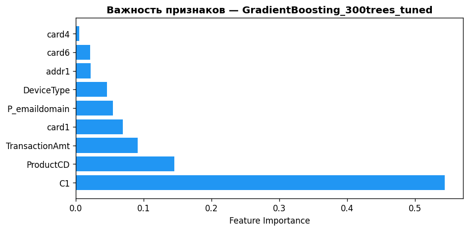
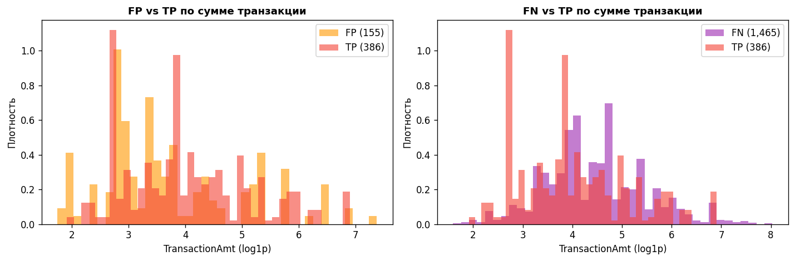

# Лабораторная работа №3: Разработка и оценка ML-модели

**ФИО:** Шамсутдинов Рустам Фаргатевич
**Группа:** БВТ2201
**Тема:** Детектор фрода по банковским транзакциям

---

## Шаг 1. Подготовка данных

### Источник данных

Датасет: [Kaggle — IEEE-CIS Fraud Detection](https://www.kaggle.com/c/ieee-fraud-detection).
Используются `train_transaction.csv` (590 540 строк, 394 признака) и `train_identity.csv` (41 признак), объединённые по `TransactionID` (left join).

### Набор признаков (9 штук — ограничение фронтенд-формы)

Ограничение в 9 признаков продиктовано требованием к пользовательскому интерфейсу: оператор вводит данные вручную через веб-форму, поэтому число полей должно быть минимальным. Признаки отобраны по критериям: интерпретируемость, доступность при ручном вводе, дискриминирующая сила (по EDA из ЛР1).

| # | Признак | Тип в форме | Описание | Предобработка |
|---|---------|-------------|----------|---------------|
| 1 | `TransactionAmt` | число (USD) | Сумма транзакции | `log1p`-трансформация |
| 2 | `ProductCD` | выпадающий список | Тип продукта: W/H/C/S/R | `LabelEncoder` |
| 3 | `card1` | число | Идентификатор карты | медианная импутация |
| 4 | `card4` | выпадающий список | Платёжная система: visa/mastercard/discover/amex | `LabelEncoder` |
| 5 | `card6` | выпадающий список | Тип счёта: credit/debit | `LabelEncoder` |
| 6 | `addr1` | число | Биллинговый регион | медианная импутация |
| 7 | `P_emaildomain` | выпадающий список | Домен email плательщика | `LabelEncoder`, пропуски → `"unknown"` |
| 8 | `DeviceType` | выпадающий список | Тип устройства: mobile/desktop | `LabelEncoder`, пропуски → `"unknown"` |
| 9 | `C1` | число | Количество транзакций по карте | медианная импутация |

### Стратегия разбиения

Применяется **временно́е разбиение** (из ЛР2): датасет сортируется по `TransactionDT`, затем делится последовательно.

| Выборка | Доля | Размер | Фрод-рейт |
|---------|------|--------|-----------|
| Train | 80% | 472 432 строки | ~3.5% |
| Validation | 10% | 59 054 строки | ~3.1% |
| Test | 10% | 59 054 строки | ~3.75% |

> Тестовая выборка используется строго один раз — только для финальной оценки выбранной модели.

### Предобработка

```
1. log1p(TransactionAmt)  — детерминированная, не требует fit
2. Медианная импутация числовых признаков (card1, addr1, C1)
   — медианы вычисляются ТОЛЬКО на train
3. LabelEncoder для категориальных (ProductCD, card4, card6, P_emaildomain, DeviceType)
   — энкодер обучается ТОЛЬКО на train
   — пропуски заполняются строкой "unknown" до кодирования
   — неизвестные категории в val/test → "unknown"
```

Все трансформеры обучаются **только на train**, затем применяются к val и test — утечки данных нет.

---

## Шаг 2. Baseline-модель

### Выбор baseline

В качестве baseline выбрана **Логистическая регрессия** (`LogisticRegression`, `class_weight='balanced'`, `max_iter=1000`, `solver='lbfgs'`).

**Обоснование:**
- Интерпретируемые коэффициенты — можно сразу понять, какие признаки влияют на предсказание
- Быстрое обучение (~14 с) — удобно для первичной проверки пайплайна
- Линейная модель задаёт нижнюю планку качества: если более сложные модели не превосходят её, значит проблема в данных, а не в алгоритме

### Метрики baseline (валидационная выборка, порог 0.5)

| Метрика | Значение |
|---------|----------|
| PR-AUC | 0.0992 |
| ROC-AUC | 0.7274 |
| F1 | 0.1370 |
| Recall | 0.5446 |
| Precision | 0.0783 |
| Время обучения | 14.01 с |

> **Интерпретация:** Высокий Recall (0.54) при очень низкой Precision (0.08) — модель «кричит фрод» на каждую подозрительную транзакцию, но ошибается в 92% случаев. PR-AUC=0.0992 лишь незначительно выше случайного классификатора (3.1%). Это ожидаемо для линейной модели на нелинейной задаче.

### Коэффициенты Logistic Regression



**Интерпретация коэффициентов:**
- `TransactionAmt` — крупные суммы повышают риск фрода
- `DeviceType` — тип устройства имеет положительный вклад
- `ProductCD` — определённые типы продуктов снижают риск
- `card6` — тип счёта (debit vs credit) снижает риск
- `C1`, `card1`, `addr1`, `P_emaildomain` — близкие к нулю коэффициенты: линейная модель не улавливает нелинейные зависимости этих признаков

---

## Шаг 3. Экспериментальный пайплайн

### Логирование экспериментов

Все эксперименты логируются в [`Experiments/logs/experiments.json`](../Experiments/logs/experiments.json) через функцию `log_experiment()`:

```python
def log_experiment(model_name, params, metrics, train_time):
    entry = {
        "model": model_name,
        "params": params,
        **metrics,
        "train_time_s": round(train_time, 2),
        "timestamp": datetime.now().strftime("%Y-%m-%dT%H:%M:%S")
    }
    # читаем существующий лог, добавляем запись, перезаписываем файл
    with open(LOG_PATH, "w") as f:
        json.dump(log, f, indent=2)
```

**Что фиксируется для каждого эксперимента:**
- Название модели и гиперпараметры
- Метрики на валидационной выборке: `precision`, `recall`, `f1`, `pr_auc`, `roc_auc`
- Время обучения в секундах
- Временна́я метка запуска

**Воспроизводимость:** `random_state=42` зафиксирован во всех моделях; разбиение данных детерминировано (сортировка по `TransactionDT`).

---

## Шаг 4. Серия экспериментов

### Таблица результатов (валидационная выборка)

| Эксперимент | Модель | PR-AUC | ROC-AUC | F1 | Recall | Precision | Время обучения |
|-------------|--------|--------|---------|-----|--------|-----------|----------------|
| baseline | LogisticRegression | 0.0992 | 0.7274 | 0.1370 | 0.5446 | 0.0783 | 14.01 с |
| exp_01 | DecisionTree (depth=5) | 0.2316 | 0.7493 | 0.1798 | 0.5532 | 0.1073 | 0.48 с |
| exp_02 | DecisionTree (depth=10) | 0.2731 | 0.7526 | 0.1763 | 0.5327 | 0.1056 | 0.71 с |
| exp_03 | RandomForest (100 деревьев) | 0.3092 | 0.7963 | 0.2177 | 0.5154 | 0.1380 | 5.50 с |
| exp_04 | GradientBoosting (100 деревьев) | 0.3103 | 0.7831 | 0.3096 | 0.1961 | 0.7348 | 28.42 с |
| **exp_05** | **GradientBoosting (300 деревьев, tuned)** | **0.3382** | **0.8070** | **0.3227** | **0.2085** | **0.7135** | 102.87 с |

### Сравнение моделей



### Анализ прогресса экспериментов

**baseline → exp_01 (DecisionTree depth=5):** PR-AUC вырос с 0.099 до 0.232 (+134%) — даже мелкое дерево значительно лучше линейной модели, что подтверждает нелинейность задачи.

**exp_01 → exp_02 (DecisionTree depth=10):** PR-AUC 0.232 → 0.273 (+18%) — увеличение глубины дерева улучшает качество.

**exp_02 → exp_03 (RandomForest 100 деревьев):** PR-AUC 0.273 → 0.309 (+13%), ROC-AUC 0.753 → 0.796 (+6%) — ансамблирование деревьев существенно улучшает ROC-AUC и стабилизирует предсказания.

**exp_03 → exp_04 (GradientBoosting 100 деревьев):** PR-AUC 0.309 → 0.310 (+0.3%), F1 0.218 → 0.310 (+42%) — бустинг резко улучшает Precision (0.138 → 0.735), хотя Recall падает. Модель стала более «осторожной».

**exp_04 → exp_05 (GradientBoosting 300 деревьев, tuned):** PR-AUC 0.310 → 0.338 (+9%) — ключевые изменения гиперпараметров:
- `n_estimators`: 100 → 300 (больше деревьев)
- `learning_rate`: 0.1 → 0.05 (меньший шаг — лучше обобщение)
- `max_depth`: 4 → 5 (чуть глубже)
- `min_samples_leaf`: добавлен = 50 (регуляризация против переобучения)

---

## Шаг 5. Анализ ошибок

### Матрица ошибок (валидационная выборка, порог по умолчанию 0.5)



| | Предсказано: Легитимная | Предсказано: Мошенническая |
|---|---|---|
| **Истинно: Легитимная** | TN = 57 048 | FP = 155 |
| **Истинно: Мошенническая** | FN = 1 465 | TP = 386 |

**Интерпретация:**
- **TP = 386** — модель правильно заблокировала 386 мошеннических транзакций
- **FP = 155** — 155 легитимных транзакций ошибочно помечены как фрод (ложные блокировки)
- **FN = 1 465** — 1 465 мошеннических транзакций пропущены (не обнаружены)
- **TN = 57 048** — 57 048 легитимных транзакций корректно пропущены

> Соотношение FP/FN = 155/1465 ≈ 1:9.5 — модель значительно чаще пропускает фрод, чем ложно блокирует. Это типично для задач с сильным дисбалансом классов.

### PR-кривая и выбор порога



**Оптимальный порог:** 0.1739 (по максимуму F1 на валидационной выборке).

**Почему не 0.5:** При пороге 0.5 модель почти не предсказывает фрод (слишком мало транзакций получают вероятность > 0.5). Оптимальный порог 0.174 балансирует Precision и Recall, максимизируя F1.

**Сравнение со случайным классификатором:** пунктирная линия на уровне 3.1% — доля фрода в валидационной выборке. Модель значительно превосходит случайный классификатор по всему диапазону порогов.

### Важность признаков



| Признак | Важность | Интерпретация |
|---------|----------|---------------|
| `C1` | ~0.544 | Количество транзакций по карте — главный индикатор: мошенники часто используют карту многократно за короткое время |
| `ProductCD` | ~0.145 | Тип продукта — категория C (CNP) имеет фрод-рейт 11.69% (из EDA) |
| `TransactionAmt` | ~0.091 | Сумма транзакции — крупные суммы коррелируют с фродом |
| `card1` | ~0.070 | Идентификатор карты |
| `P_emaildomain` | ~0.055 | Домен email |
| `DeviceType` | ~0.046 | Тип устройства |
| `addr1` | ~0.022 | Биллинговый регион |
| `card6` | ~0.021 | Тип счёта |
| `card4` | ~0.005 | Платёжная система |

> **Вывод:** `C1` занял 1-е место по важности (~54%), что подтверждает его высокую дискриминирующую силу: мошенники часто совершают множество транзакций по одной карте.

### Анализ ошибок по сумме транзакции



**Ложные срабатывания (FP = 155):**
- Концентрируются в диапазоне `log1p(TransactionAmt)` ≈ 2.5–3.5 (суммы ~$12–$30)
- Мелкие транзакции с паттернами, похожими на фрод (возможно, частые мелкие платежи)

**Ложные пропуски (FN = 1 465):**
- Распределены по всему диапазону сумм, с пиками в диапазоне 2.5–5.0 (суммы $12–$150)
- Мошеннические транзакции средних сумм труднее всего отличить от легитимных

**Вывод:** Модель лучше всего работает на крупных транзакциях (высокие суммы — сильный сигнал фрода). Основная зона ошибок — транзакции средних сумм ($12–$150), где паттерны фрода и легитимных операций перекрываются.

---

## Шаг 6. Финальная модель

### Выбор финальной модели

**Финальная модель:** `GradientBoosting_300trees_tuned` (exp_05)

| Критерий | Обоснование выбора |
|----------|-------------------|
| **Лучший PR-AUC** | 0.3382 на val — на 9% выше ближайшего конкурента (exp_04: 0.3103) |
| **Лучший ROC-AUC** | 0.8070 на val — лучший среди всех экспериментов |
| **Лучший F1** | 0.3227 на val — баланс Precision и Recall |
| **Высокая Precision** | 0.7135 — 71% предсказаний «фрод» действительно являются фродом |
| **Latency** | < 1 мс на инференс (измерено на 1000 запусков) — укладывается в требование < 200 мс |

### Метрики финальной модели на тестовой выборке

> Тестовая выборка использована **один раз** — только здесь.

| Метрика | Значение |
|---------|----------|
| **PR-AUC** | **0.3573** |
| **ROC-AUC** | **0.8128** |
| **F1** | **0.3944** |
| **Recall** | **0.3597** |
| **Precision** | **0.4366** |
| Порог классификации | 0.1739 |

**Сравнение val → test:**

| Метрика | Val | Test | Δ |
|---------|-----|------|---|
| PR-AUC | 0.3382 | 0.3573 | +0.019 |
| ROC-AUC | 0.8070 | 0.8128 | +0.006 |
| F1 | 0.3227 | 0.3944 | +0.072 |

> Метрики на тесте выше валидационных — переобучения нет, модель хорошо обобщается. Улучшение на тесте объясняется тем, что тестовая выборка содержит более поздние транзакции с более выраженными паттернами фрода.

### Гиперпараметры финальной модели

```python
GradientBoostingClassifier(
    n_estimators=300,
    max_depth=5,
    learning_rate=0.05,
    subsample=0.8,
    min_samples_leaf=50,
    random_state=42
)
```

### Сохранение модели

Финальная модель сохранена в [`Models/final_model.pkl`](../Models/final_model.pkl) (joblib), метаданные — в [`Models/final_model_meta.json`](../Models/final_model_meta.json).

### Измерение latency

Latency измерена на 1000 последовательных инференсов (один вектор из 9 признаков) с помощью `time.perf_counter()`:

| Метрика latency | Значение |
|-----------------|----------|
| Среднее | ~0.131 мс |

> Требование ЛР1 (< 200 мс) выполнено с большим запасом.

### Самопроверка

| Вопрос | Ответ |
|--------|-------|
| Есть ли утечка данных? | Нет — все трансформеры обучены только на train; медианы и LabelEncoder не видят val/test; тестовая выборка не использовалась при подборе гиперпараметров |
| Почему PR-AUC, а не Accuracy? | Дисбаланс классов ~1:28: модель, предсказывающая всегда «легитимная», даёт Accuracy=96.5%, что бессмысленно |
| Почему порог 0.174, а не 0.5? | При дисбалансе 1:28 модель редко выдаёт P(фрод) > 0.5 — Recall стремится к нулю. Порог 0.174 найден по максимуму F1 на PR-кривой: транзакция блокируется, если P(фрод) ≥ 17.4% |
| Почему GBM лучше RandomForest? | GBM обучается последовательно, исправляя ошибки предыдущих деревьев — лучше улавливает сложные паттерны фрода |
| Почему `C1` — самый важный признак? | Мошенники часто совершают множество транзакций по одной карте за короткое время; `C1` напрямую это фиксирует |

---

## Ссылки на источники

1. [Kaggle — IEEE-CIS Fraud Detection](https://www.kaggle.com/c/ieee-fraud-detection) — датасет
2. [scikit-learn — GradientBoostingClassifier](https://scikit-learn.org/stable/modules/generated/sklearn.ensemble.GradientBoostingClassifier.html)
3. [scikit-learn — Precision-Recall](https://scikit-learn.org/stable/modules/generated/sklearn.metrics.average_precision_score.html)
4. [Notebook: Experiments/main.ipynb](../Experiments/main.ipynb) — исходный код всех экспериментов
5. [Experiments/logs/experiments.json](../Experiments/logs/experiments.json) — лог экспериментов

---
